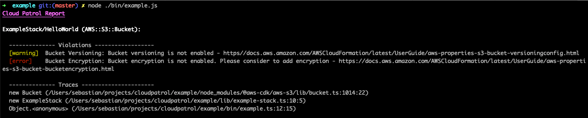

# Policy as Code for the Cloud Development Kit

Cloud Patrol let's you define common policies with remediation strategies for your [AWS CDK](https://github.com/aws/aws-cdk/) stacks and enforce them across your CDK stacks / applications.

*NB: This is an alpha release - Everything might change.*

## Use Cases

Make sure your Cloud resources are:

- Tagged properly
- Secure by default
- Following naming conventions
- Within your budget
- Not provisioned with hardcoded secrets
- Pretty much whatever you can think of :)

## Geetting Started

```
yarn add cloudpatrol
```

### Example 

Given this example:

```typescript
import * as cdk from '@aws-cdk/core';
import { ExampleStack } from '../lib/example-stack';
import { AwsCdkPatrol } from 'cloudpatrol/lib'
import { awsDefaults } from 'cloudpatrol/policies/aws/packs/good-defaults'

const app = new cdk.App();
const stack = new ExampleStack(app, 'ExampleStack');

const cloudPatrol = new AwsCdkPatrol(awsDefaults)
cloudPatrol.check(stack)
```

We can do the following:



Check the full [example](./example/bin/example.ts).

## Reports

Currently, there are two reporting mechanisms:

### AWS CDK inline report

As part of your normal CDK commands (e.g. `cdk synth --app bin/example.js`), will perform reporting on the Construct nodes itself and stop the synth process on errors.

### Terminal Report

For CI / CD workflows and local testing, just execute your CDK app directly with `node` (e.g. `node ./bin/example.js`). This is great for dedicated validation of policies without the synthesized output.

### Custom Reporting

Hasn't been implemented, yet. But it's on the agenda, and probably possible right now with a bit of effort.

## Policies

### Full Example

```typescript
/**
 * This Policy ensures that a bucket is properly versioned
 *
 * @cloudformationResource AWS::S3::Bucket
 * @see https://docs.aws.amazon.com/AWSCloudFormation/latest/UserGuide/aws-properties-s3-bucket-versioningconfig.html
 */
export class BucketVersioningPolicy extends Policy implements PolicyInterface {  
  public policyName = 'Bucket Versioning'
  public description = 'This ensures that a bucket is properly versioned'
  public link = 'https//docs.aws.amazon.com/AWSCloudFormation/latest/UserGuide/aws-properties-s3-bucket-versioningconfig.html'
  public scope = s3.CfnBucket
  
  public validator(node: s3.CfnBucket, reporter: Reportable): void { 
    if (!node.versioningConfiguration || 
      (!cdk.Tokenization.isResolvable(node.versioningConfiguration) && node.versioningConfiguration.status !== 'Enabled')) {
      reporter.addWarning(node, this, 'Bucket versioning is not enabled');
    }
  }
}
```

### Implemented Policies

- [Ec2InstanceTypePolicy](./policies/aws/ec2.ts)
- [BucketVersioningPolicy](./policies/aws/s3-bucket.ts)
- [BucketEncryptionPolicy](./policies/aws/s3-bucket.ts)
- ... create a Pull Request to add yours :)

### Custom Policies

Policies have to follow this schema

```typescript
class YourCustomPolicy extends Policy implements PolicyInterface {
  //...
}
```

#### Scope
There are two options to define the scope of a Policy:

*Define an explicit scope:*

```typescript
class YourCustomPolicy extends Policy implements PolicyInterface {
  //...
  public scope = s3.CfnBucket
  //...
}
```

*Overwrite `isApplicable`:*

```typescript
class YourCustomPolicy extends Policy implements PolicyInterface {
  //...
  public isApplicable(node: cdk.Resource): boolean {
    // your custom logic here
  }
  //...
```

#### Policy Validation Logic

```typescript
class YourCustomPolicy extends Policy implements PolicyInterface {
  //...
  public validator(node: s3.CfnBucket, reporter: Reportable, context: PolicyContext): void { 
    // your custom logic here.
  }
  //...
```

Found issues can be reported via the `reporter` object. You can report multiple issues per Policy. There are three different issue severities:

- Info
- Warning
- Error 

`context` is persistent across the entire Stack validation and can be passed in for dynamic information.

## How does it work?

Cloud Patrol makes use of [Aspects](https://docs.aws.amazon.com/cdk/latest/guide/aspects.html) to visit all nodes in a given [Construct](https://github.com/aws/constructs) (e.g. your stack). Aspects will be applied in the [prepare](https://github.com/aws/constructs/blob/166ba7ef9e88fd9ffbedd6fa2e6d096ace370ca4/lib/construct.ts#L427-L445) stage, which will be called before synthesizing the stack. That's great if you're going to synthesize anyway. However, if you just wanna run the Cloud Patrol checks, we have to invoke the preparation by ourselves. Something along the lines of this:

```typescript
  stack.node.applyAspect(this);
  cdk.ConstructNode.prepare(stack.node);
```

## Roadmap

- [ ] Simplify Policy definition
- [ ] Drop dependency to aws-cdk/core where possible, extract the rest to dedicated package
- [ ] Implement remediation strategies
- [ ] Documentation
- [ ] Policy generator
- [ ] Modularize and detangle `Reporter` to allow multiple ways of reporting
- [ ] [Github Actions](https://github.com/features/actions) for easy integration
- [ ] `.cloudpatrol` file?
- [ ] Provide more policies out of the box 
- [ ] CLI which autodetects Stacks for inspection
- [ ] Integration tests against the last X releases of the [AWS CDK](https://github.com/aws/aws-cdk/)
- [ ] Integrate supported languages of [jsii](https://github.com/aws/jsii)
- [ ] Integrate in CDK based frameworks like [cdk8s](https://github.com/awslabs/cdk8s) and [terrastack](https://github.com/terrastackio/terrastack)